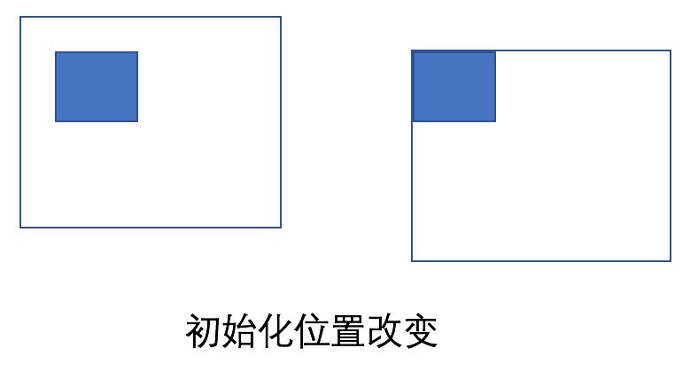

# js拖拽原理

我们先看一下操作步骤：

1. 鼠标悬浮到元素上，并按住
2. 鼠标移动，元素跟着移动
3. 松开鼠标按键，再次移动鼠标，元素不会跟着移动

### 第一步实现

```javascript
// html: <div class="drag-item"></div>
var point = {}
var dragItem = document.querySelector('.drag-item')
$dragItem.addEventListener('mousedown', function(e){
  	point = {
  		x: e.clientX,
    	y: e.clientY
  	}
})
```

按住目标元素，并记住它的位置

### 第二步实现

```javascript
document.addEventListener('mousemove', function(e){
    $dragItem.style.left = (e.clientX - point.x)+'px';
    $dragItem.style.top = (e.clientY - point.y)+'px';
})
```

随着鼠标的移动来不断地改变目标元素的位置

### 第三步实现

此时的效果是按住目标元素，鼠标移动元素移动，但鼠标释放后移动的话元素还是会跟着元素，此时我们需要加一个tag来告诉代码啥时候开始控制元素，啥时候不需要控制元素。

```
document.addEventListener('mouseup', function(e){
  active = false
})
```

具体代码如下：

```javascript
var target = {};
target.$item = document.querySelector('.drag-item')
target.$item.addEventListener('mousedown', function(e){
    target.active = true
  	target.point = {
  		x: e.clientX,
    	y: e.clientY
  	}
})
document.addEventListener('mousemove', function(e){
    if(target.active){
        target.$item.style.left = (e.clientX - target.point.x)+'px';
        target.$item.style.top = (e.clientY - target.point.y)+'px';  
    }
})
document.addEventListener('mouseup', function(e){
    target.active = false
})
```

我们发现如果目标元素在屏幕的左上角，移动的时候是想要的效果。


而目标元素在其它位置，移动的时候它仅仅移动的是鼠标的偏移量。

那如果我们每次激活元素拖拽的时候都当它是屏幕的左上角不就行了么，如下图：



所以只需要将初始化的位置减去它的偏移量即可

```javascript
target.point = {
	x: e.clientX - target.$item.offsetLeft,
	y: e.clientY - target.$item.offsetTop
}
```

具体效果请看[demo](http://little-white.github.io/src/index.html)
